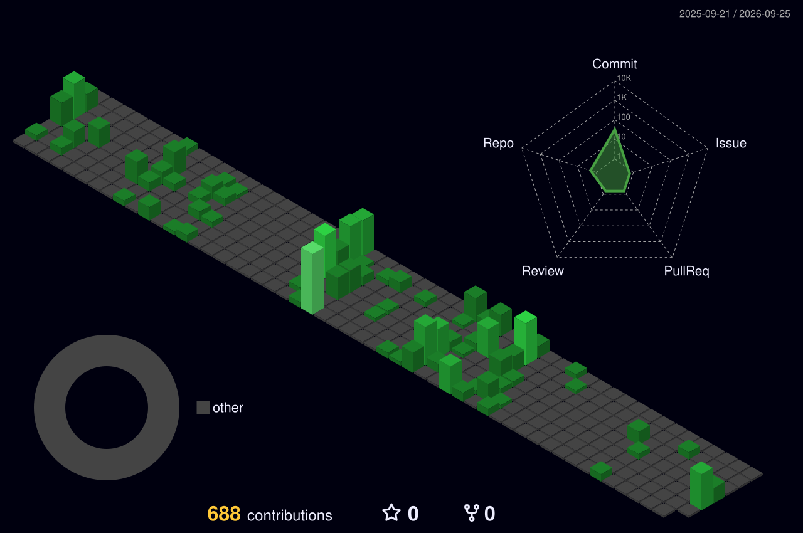
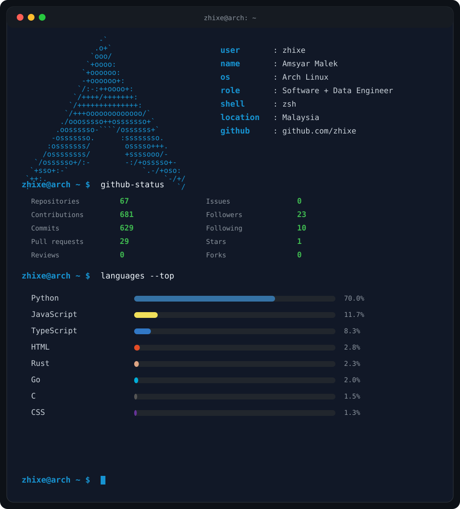

<div align="center">

# 👋 Hi, I'm Amsyar Malek

### Software Engineer · Data Engineer · Systems Builder

I build software, data platforms, and reliable production systems.

Based in Malaysia 🇲🇾

<br>

[](https://amsyar-malek.com)
[](https://github.com/zhixe)

</div>

---

## 🚀 About Me

I'm a Software and Data Engineer interested in building systems that are practical, maintainable, scalable, and reliable.

My work spans **software engineering, data engineering, backend systems, data platforms, infrastructure, system architecture, performance engineering, and release engineering**.

I enjoy understanding how systems work end-to-end from application logic and APIs to data pipelines, databases, service integration, infrastructure, deployment, performance, and high availability.

---

## 💻 Current Focus

| Area | Focus |
|---|---|
| **Software Engineering** | Backend development, APIs, business workflows and maintainable application architecture |
| **Data Engineering** | Data pipelines, ETL/ELT, streaming, data warehouses and analytical platforms |
| **Data Platforms** | Apache Doris, SQL Server, Kafka and enterprise data systems |
| **System Architecture** | Modular systems, service boundaries, async processing and resilient integrations |
| **Infrastructure** | Linux, Docker, Nginx, Tomcat and production deployment environments |
| **Reliability** | High availability, disaster recovery, failover and operational resilience |
| **Performance Engineering** | Load testing, stress testing, latency analysis and concurrent-user validation |
| **Release Engineering** | Git-based promotion, deployment verification, health checks and recovery |

---

## 🛠️ Tech Stack

### Languages


### Software Engineering


### Data Engineering & Databases


### Infrastructure & Release Engineering


### Testing & Performance


### Architecture & Reliability


<!--
---

## 🧩 Engineering Interests

```text
Software Engineering
├── Backend Systems
├── REST APIs
├── Business Workflows
├── Application Architecture
└── Service Integration

Data Engineering
├── Data Pipelines
├── ETL / ELT
├── Streaming
├── Data Warehouses
├── Data Lakes
└── Analytical Platforms

System Architecture
├── Modular Monolith
├── Layered Architecture
├── API Contract Design
├── Async Processing
├── Service Boundaries
└── Resilient Integration

Platform & Reliability
├── Linux
├── Docker
├── Reverse Proxy
├── High Availability
├── Disaster Recovery
├── Deployment Verification
└── Observability

Performance Engineering
├── Unit & Integration Testing
├── Regression Testing
├── Smoke Testing
├── Load Testing
├── Stress Testing
├── Concurrent User Testing
├── Latency Analysis
└── Performance Monitoring
```
-->
---

## 🔥 GitHub Streak

<div align="center">


</div>

---

## 🧊 Yearly Contribution Graph

<div align="center">



</div>

---
<!--
## 🖥️ Engineering Console

<div align="center">



</div>
-->
## 🖥️ Engineering Console

<div align="center">


</div>

<!--

## 🐍 Contribution Snake

<div align="center">

<picture>
  <source
    media="(prefers-color-scheme: dark)"
    srcset="https://raw.githubusercontent.com/zhixe/zhixe/output/github-contribution-grid-snake-dark.svg"
  />
  <source
    media="(prefers-color-scheme: light)"
    srcset="https://raw.githubusercontent.com/zhixe/zhixe/output/github-contribution-grid-snake.svg"
  />
  
</picture>

</div>

-->
